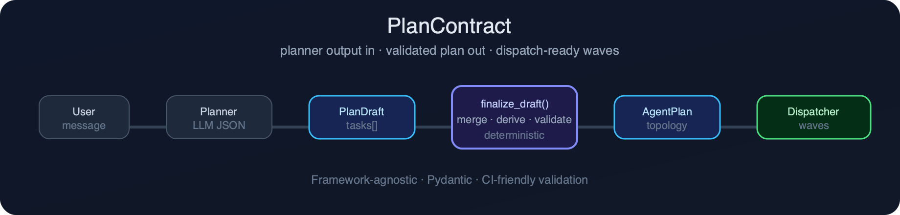
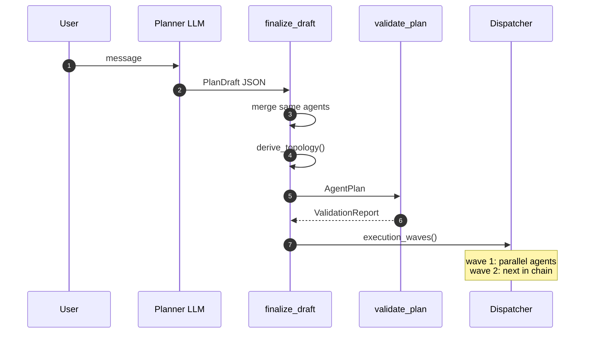
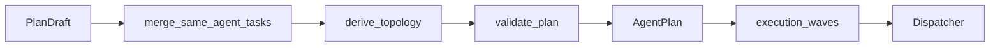
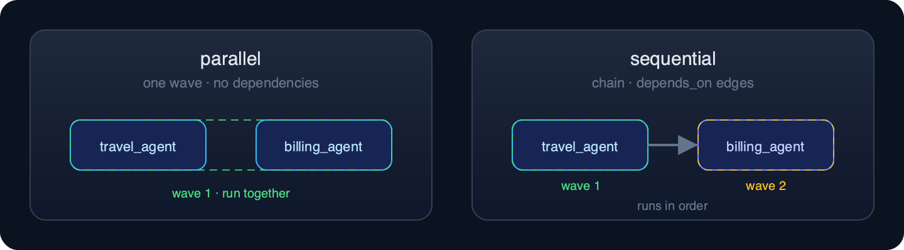

<div align="center">



<br/>

**Framework-agnostic schemas and validators for multi-agent turn routing plans.**

*Routing plan contracts — not behavioral agent safety contracts.*

<br/>

[](https://www.python.org/downloads/)
[](LICENSE)
[](#)
[](https://github.com/plancontract/plancontract/actions/workflows/ci.yml)
[](https://docs.astral.sh/ruff/)
[](https://docs.pydantic.dev/)

<br/>

[**Install**](#install) · [**Quick start**](#quick-start) · [**Topologies**](#topologies-at-a-glance) · [**CLI**](#cli) · [**Design**](docs/design.md) · [**Contributing**](CONTRIBUTING.md)

</div>

---

## Table of contents

- [Why PlanContract?](#why-plancontract)
- [How it works](#how-it-works)
- [Install](#install)
- [Quick start](#quick-start)
- [Topologies at a glance](#topologies-at-a-glance)
- [Validation that CI can gate on](#validation-that-ci-can-gate-on)
- [CLI](#cli)
- [Core concepts](#core-concepts)
- [Project structure](#project-structure)
- [Roadmap](#roadmap)
- [Contributing & license](#contributing--license)

---

## Why PlanContract?

Most agent frameworks give you orchestration — LangGraph nodes, crew runners, tool loops — but **leave plan validation as an exercise**. Teams rebuild the same logic in every codebase:

| Problem | PlanContract answer |
| --- | --- |
| LLM emits invalid agent IDs | `PlanPolicy` allowlists |
| Too many tasks per turn | configurable `max_tasks` |
| Duplicate or missing task IDs | structured `ValidationReport` |
| Cycles in `depends_on` | Kahn topological sort + `DEPENDENCY_CYCLE` |
| Wrong `parallel` vs `sequential` label | **topology derived from the graph**, not trusted from the LLM |
| Same agent scheduled twice | `merge_same_agent_tasks()` |

PlanContract is the **contract between planner and dispatcher**: typed schemas in, validated execution waves out.

> **Note:** This is not [agentcontract](https://pypi.org/project/agentcontract/) — that project covers behavioral/safety contracts for agent outputs. PlanContract covers **routing plan structure** for multi-agent turns.

---

## How it works



<details>
<summary><strong>Pipeline diagram (static)</strong></summary>



</details>

---

## Install

**From PyPI:**

```bash
pip install plancontract
# or
uv add plancontract
```

> Package name is reserved; publish with `uv publish` when ready. Until then, install from source below.

**From source:**

```bash
git clone https://github.com/plancontract/plancontract.git
cd plancontract
uv sync
make ci
```

Requires [uv](https://docs.astral.sh/uv/) for development. Python **3.11+**.

---

## Quick start

```python
from plancontract import PlanDraft, PlanPolicy, TaskDraft, finalize_draft, validate_plan

draft = PlanDraft(
    tasks=[
        TaskDraft(
            task_id="t1",
            agent_id="travel_agent",
            instruction="find flights to Tokyo",
        ),
        TaskDraft(
            task_id="t2",
            agent_id="billing_agent",
            instruction="check travel insurance coverage",
        ),
    ],
)

plan = finalize_draft(draft, policy=PlanPolicy.demo())

print(plan.topology)          # PlanTopology.PARALLEL
print(plan.execution_waves()) # one wave: [travel_agent, billing_agent]

assert validate_plan(plan, policy=PlanPolicy.demo()).ok
```

**Run the bundled example:**

```bash
uv run python examples/basic_usage.py
```

<details>
<summary><strong>Example output</strong></summary>

```text
topology: parallel
agents: ['travel_agent', 'billing_agent']
waves:
  wave 1: ['travel_agent', 'billing_agent']
valid: True
```

</details>

---

## Topologies at a glance

Topology is **derived from dependencies** during `finalize_draft()` — never copied blindly from LLM output.



| Topology | Tasks | Dependency shape | Waves |
| --- | --- | --- | --- |
| `single` | 1 | — | 1 |
| `parallel` | 2–3 | none (independent) | 1 |
| `sequential` | 2–3 | chain | 1 per task |
| `mixed` | 3 | fan-in / fan-out | 2+ |
| `deferred` | 0 | — | 0 |
| `fallback` | — | reserved | — |

<details>
<summary><strong>Sequential example — draft in, plan out</strong></summary>

Input [`examples/data/plan_draft.sequential.json`](examples/data/plan_draft.sequential.json):

```json
{
  "tasks": [
    {
      "task_id": "t1",
      "agent_id": "travel_agent",
      "instruction": "shortlist weekend destinations within 3 hours"
    },
    {
      "task_id": "t2",
      "agent_id": "billing_agent",
      "instruction": "estimate total cost for the selected destination",
      "depends_on": ["t1"]
    }
  ],
  "locale": "en",
  "summary": "Pick a destination, then estimate cost."
}
```

```bash
plancontract finalize examples/data/plan_draft.sequential.json --demo-policy
```

```json
{
  "topology": "sequential",
  "locale": "en",
  "title": "",
  "tasks": [
    {
      "task_id": "t1",
      "agent_id": "travel_agent",
      "instruction": "shortlist weekend destinations within 3 hours",
      "depends_on": [],
      "extensions": {}
    },
    {
      "task_id": "t2",
      "agent_id": "billing_agent",
      "instruction": "estimate total cost for the selected destination",
      "depends_on": ["t1"],
      "extensions": {}
    }
  ]
}
```

</details>

---

## Validation that CI can gate on

Structured errors — not just exceptions:

```python
from plancontract import AgentPlan, PlanPolicy, ValidationCode, validate_plan

plan = AgentPlan.model_validate_json(open("plan.json").read())
report = validate_plan(
    plan,
    policy=PlanPolicy(allowed_agents=frozenset({"travel_agent", "billing_agent"})),
)

if not report.ok:
    for issue in report.issues:
        print(issue.code, issue.message)  # ValidationCode.UNKNOWN_AGENT, ...

report.raise_if_invalid()  # raises PlanValidationError for CI
```

**GitHub Actions:**

```yaml
- run: pip install plancontract
- run: plancontract validate plans/candidate.json --mode draft --demo-policy
```

<details>
<summary><strong>Example validation failure (CLI)</strong></summary>

```bash
plancontract validate bad-plan.json --mode draft --demo-policy
```

```json
{
  "ok": false,
  "error_count": 1,
  "issues": [
    {
      "code": "unknown_agent",
      "message": "unknown or disallowed agent_id 'unknown_agent'",
      "task_id": "t1",
      "field_name": "agent_id",
      "context": {}
    }
  ]
}
```

Use `--mode draft` for LLM planner JSON; omit it (default `plan`) for finalized `AgentPlan` files.

</details>

---

## CLI

| Command | Purpose |
| --- | --- |
| `plancontract validate <file>` | Validate a plan or draft JSON |
| `plancontract finalize <draft>` | Merge, derive topology, validate |
| `plancontract schema draft \| plan` | Print JSON Schema |

```bash
# Validate LLM draft with demo agent allowlist
plancontract validate examples/data/plan_draft.parallel.json --mode draft --demo-policy

# Finalize draft → AgentPlan
plancontract finalize examples/data/plan_draft.sequential.json --demo-policy

# Export schemas (also committed under schemas/)
plancontract schema draft > plan_draft.schema.json
plancontract schema plan   > agent_plan.schema.json
```

---

## Core concepts

| Type | Role |
| --- | --- |
| `TaskDraft` | One LLM-proposed agent task |
| `PlanDraft` | Planner output (tasks + locale + summary) |
| `PlanTask` | Runtime task with validated fields |
| `AgentPlan` | Finalized plan with derived `PlanTopology` |
| `PlanPolicy` | Allowlists, limits, extension rules |
| `ValidationReport` | Pass/fail with machine-readable `ValidationCode` |

**Public API:**

```python
from plancontract import (
    AgentPlan,
    PlanDraft,
    PlanPolicy,
    PlanTopology,
    ValidationCode,
    derive_topology,
    finalize_draft,
    merge_same_agent_tasks,
    topological_waves,
    validate_plan,
)
```

See [docs/design.md](docs/design.md) for architecture notes and [schemas/](schemas/) for committed JSON Schema.

---

## Project structure

```text
plancontract/
├── assets/                    # README visuals (SVG source + PNG for GitHub)
├── docs/
│   └── design.md              # Architecture notes
├── examples/
│   ├── basic_usage.py         # Runnable quick-start script
│   └── data/
│       ├── plan_draft.parallel.json
│       └── plan_draft.sequential.json
├── schemas/
│   ├── plan_draft.schema.json # Committed JSON Schema
│   └── agent_plan.schema.json
├── src/plancontract/
│   ├── __init__.py            # Public API
│   ├── __main__.py            # python -m plancontract
│   ├── py.typed               # PEP 561 typing marker
│   ├── models.py              # Pydantic schemas (PlanDraft, AgentPlan, …)
│   ├── policy.py              # PlanPolicy constraints
│   ├── topology.py            # Graph scheduling + topology derivation
│   ├── merge.py               # Same-agent task merge
│   ├── validate.py            # Structured validation
│   ├── finalize.py            # Draft → plan pipeline
│   ├── errors.py              # ValidationReport and codes
│   └── cli.py                 # plancontract CLI
└── tests/
    ├── conftest.py            # Shared fixtures
    ├── helpers.py             # Test task builders
    ├── test_topology.py       # Graph + derive_topology
    ├── test_validate.py       # Validation rules
    ├── test_finalize.py
    ├── test_merge.py
    ├── test_models.py
    ├── test_errors.py
    ├── test_cli.py
    ├── test_schemas.py
    └── test_integration.py
```

---

## Roadmap

- [ ] LangGraph adapter (`PlannerNode`, `DispatchNode`)
- [ ] RouteBench scorer integration
- [x] JSON Schema publishing (`schemas/`)
- [ ] `plancontract diff` for eval regression

---

## Contributing & license

Contributions welcome — see [CONTRIBUTING.md](CONTRIBUTING.md). Run `make ci` before opening a PR.

**License:** [MIT](LICENSE)

**Disclaimer:** Independent open-source project. Not affiliated with any employer or downstream product.

---

<div align="center">

<br/>

If PlanContract saves you from rewriting planner validation for the third time, consider **starring the repo**.

<br/>

<sub>Built for teams shipping multi-agent assistants with explicit planner → dispatcher contracts.</sub>

</div>
